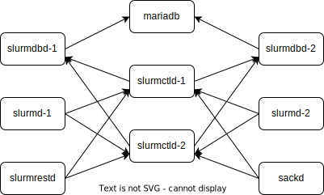

# Slurm Container

This project builds images that allow users to run Slurm and SlurmDB controllers in container/Kubernetes environments. The cluster is required to use slurm's own authentication mechanism instead of munge (ie `AuthType=auth/slurm`). 

## Getting started

Clone the project which contains some examples. Image has been published to dockerhub.
```
git clone --recursive-submodule https://gitlab.com/CSniper/slurm-container.git
cd slurm-container
```

### Minimal control plane
Create a new cluster by running this
```
root@slurm-master# mkdir -pv /opt/slurm/etc-slurm /opt/slurm/spool-slurmctld
root@slurm-master# podman run --it --rm --name slurmctld --hostname slurm-master \
>	-v /opt/slurm/spool-slurmctld:/var/spool/slurmctld:Z \
>	-v /opt/slurm/etc-slurm:/etc/slurm:Z --net=hosts --privileged -d \
>	docker.io/csniper/slurm:23.11 --role slurmctld \
>	--clustername demo --slurmctld-hosts slurm-master
```
This generates the necessary configuration and starts the slurmctld. The slurm configuration files are located under `/opt/slurm/etc-slurm`. You need to distribute these files to compute nodes/slurmd hosts under `/etc/slurm/`. By default this cluster uses dynamic node, so you need to start slurmd with "-Z" option. or you can modify the generated slurm.conf to give it a list of nodes. 

After the initial run, you can remove `clustername` and `slurmctld-hosts` options. You can remove `--role slurmctld` as well, as slurmctld is the default role.
```
root@slurm-master# podman run --it --rm --name slurmctld --hostname slurm-master \
>	-v /opt/slurm/spool-slurmctld:/var/spool/slurmctld:Z \
>	-v /opt/slurm/etc-slurm:/etc/slurm:Z --net=hosts --privileged -d \
>	docker.io/csniper/slurm:23.11 --role slurmctld 
```
If you make changes to slurm.conf, make sure you sync the file across the cluster, and then either restart the container or run `scontrol reconfigure` . 


### Extract Files for compute node and client node deployment
#### Packages
This container image comes with the local repository containing all the slurm packages you need. You could extract the packages following these steps. (eg. extract to /opt/slurm-repo):
```bash
podman create --name temp_container slurm:<tag> # create a container, without starting it
podman cp temp_container:/opt/slurm-repo/ /opt/slurm-repo/ # copy local repository
podman rm temp_container
```
The extracted directory contains a repository definition file: `slurm.repo` for dnf/yum repository, `slurm.list` for apt repository. Modify the path in the file if needed, and copy them to either `/etc/yum.repos.d/` or `/etc/apt/sources.list.d/` depends on distro, and now you can install the exact the same version and build of slurm running in the container. 
#### Configurations - /etc/slurm/
If you opt not to use a shared file system for /etc/slurm/, here is how you extract the config directory for distribution. 

```
podman cp <master container name> /etc/slurm/ ./slurm/
```
And the copy everything in this folder to /etc/slurm in all other nodes in the slurm cluster. 

If you use config-less mode, you need to at least sync `/etc/slurm/slurm.key` to compute node (slurmd) and client node (sackd)

## More examples

### Local Demo cluster (`./compose.yml`)
  

The compose.yml file included in the repository creates a very simple cluster with slurmdbd and slurmrestd enabled. 
```
podman compose -f compose.yml up -d --force-recreate
```
In the 4 slurm containers, slurmd container is required to run in systemd mode. Other containers simply start the process in the foreground.

### More complicated cluster (`./compose.dev.yml`)
  

This compose file expects a locally built image, and starts the container cluster with 2 daemons for every service, plus one api host (slurmrestd) and one submission client (sackd)

```
podman compose -f compose.dev.yml up -d --force-recreate
```

### Usage
```
$ podman run -it --rm slurm:el9 --help
Containerized Slurm control plane
Usage: /opt/local/bin/entrypoint [--clustername <arg>] [--role <arg>] [--slurmdbd-hosts <arg>] [--slurmctld-hosts <arg>] [--db <arg>] [--dbhost <arg>] [--dbuser <arg>] [--dbpass <arg>] [--(no-)init] [--(no-)keygen] [--(no-)configless] [-h|--help]
        --clustername: name of the cluster, required for init.
                env var: CLUSTERNAME (no default)
        --role: slurmctld(default)|slurmdbd|slurmd|slurmrestd|sackd.
                env var: SLURM_ROLE (default: 'slurmctld')
        --slurmdbd-hosts: comma separated list of slurmdbd hosts.
                env var: SLURMDBD_HOSTS (no default)
        --slurmctld-hosts: comma seperated list of slurmctld hosts.
                env var: SLURMCTLD_HOSTS (no default)
        --db: database name.
                env var: MYSQL_DATABASE (no default)
        --dbhost: mariadb database hostname.
                env var: SLURMDBD_STORAGEHOST (no default)
        --dbuser: database user.
                env var: MYSQL_USER (no default)
        --dbpass: database password.
                env var: MYSQL_PASSWORD (no default)
        --init, --no-init: regenerate configuration.
                env var: CONF_INIT (off by default)
        --keygen, --no-keygen: regenerate jwks.json and slurm.key.
                env var: KEYGEN (off by default)
        --configless, --no-configless: use configless mode. When enabled only slurm.key need to distributed to compute and client nodes.
                env var: CONFIGLESS (off by default)
        -h, --help: Prints help
```

## Background
There had been attempts to containerize Slurm's control plane (ie. slurmdbd and slurmctld), even running it on k8s for reliability and availability. With auth/munge being the only authentication mechanism available between Slurm daemons, the control plane containers are almost required to be authenticated the same way the login/submission and compute nodes are. This situation makes it difficult to build a generic image portable and tested across different Slurm sites. This situation changed with the release of slurm-23.11. Slurm's authentication plugin (`AuthType=auth/slurm`) is introduced in this major release, with this the control plane containers received and trusted the user information from the submission host, and hence they are not required to be authenticated. In addition, munged is not required to run alongside slurm daemons, so each container could focus on running only one of the slurm daemons (slurmctld/slurmdbd/slurmrestd/slurmd).  

