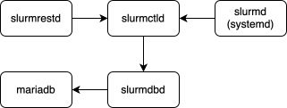
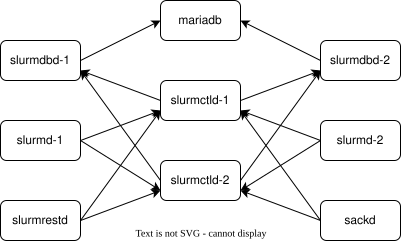

# Slurm Container

This project builds images to run Slurm and SlurmDB controllers in container and Kubernetes environments. The cluster must use Slurm token authentication (`AuthType=auth/slurm`) instead of munge.

## Getting started

The container image is available on Docker Hub.

Clone the repository and move into the project directory:
```bash
git clone --recursive-submodules https://gitlab.com/CSniper/slurm-container.git
cd slurm-container
```

### Minimal control plane

To start a new control plane, run these commands on the master host:
```bash
mkdir -pv /opt/slurm/etc-slurm /opt/slurm/spool-slurmctld
podman run -it --rm --name slurmctld --hostname slurm-master \
	-v /opt/slurm/spool-slurmctld:/var/spool/slurmctld:Z \
	-v /opt/slurm/etc-slurm:/etc/slurm:Z --net=host --privileged -d \
	docker.io/csniper/slurm:26.05 --role slurmctld \
	--clustername demo --slurmctld-hosts slurm-master
```

This command generates the configuration files and starts `slurmctld`. The Slurm configuration files are saved in `/opt/slurm/etc-slurm`. You must copy these files to `/etc/slurm/` on all compute nodes.

By default, this cluster uses dynamic nodes. Start `slurmd` with the `-Z` flag, or edit `slurm.conf` to add static nodes.

After the initial run, you can remove the `--clustername` and `--slurmctld-hosts` options. You can also remove `--role slurmctld`, because `slurmctld` is the default role.
```bash
podman run -it --rm --name slurmctld --hostname slurm-master \
	-v /opt/slurm/spool-slurmctld:/var/spool/slurmctld:Z \
	-v /opt/slurm/etc-slurm:/etc/slurm:Z --net=host --privileged -d \
	docker.io/csniper/slurm:26.05 --role slurmctld
```

If you change `slurm.conf`, make sure that you copy the file across the cluster. Then restart the container or run `scontrol reconfigure`.

### Extract files for compute and client nodes

#### Packages

The container image includes a local package repository with the Slurm packages. To extract the repository to `/opt/slurm-repo`, run these commands:
```bash
podman create --name temp_container slurm:<tag>
podman cp temp_container:/opt/slurm-repo/ /opt/slurm-repo/
podman rm temp_container
```

The extracted directory contains repository definition files. `slurm.repo` provides the repository definition for dnf and yum. `slurm.list` provides the repository definition for apt.

If necessary, change the paths inside the file. If your system uses dnf or yum, copy `slurm.repo` to `/etc/yum.repos.d/`. If your system uses apt, copy `slurm.list` to `/etc/apt/sources.list.d/`. You can then install the same version of Slurm on the host.

#### Configuration files

If you do not use a shared file system for `/etc/slurm/`, extract the directory from the master container:
```bash
podman cp <master container name>:/etc/slurm/ ./slurm/
```

Then copy all files in this directory to `/etc/slurm/` on all other nodes in the cluster.

If you use configless mode, you must copy `/etc/slurm/slurm.key` to compute nodes (`slurmd`) and client nodes (`sackd`).

## More examples

### Local demo cluster


The `compose.yml` file creates a single-node cluster. The `single` profile starts `slurmdbd`, `slurmrestd`, and a `sackd` submission client.
```bash
make up
# or:
podman compose --profile single up -d --force-recreate
```

The `slurmd` container must run in systemd mode. Other containers run their process in the foreground.

### High-availability demo cluster


The `ha` profile starts two daemons for each service. The profile also starts one `slurmrestd` API host and one `sackd` submission client.
```bash
make ha
# or:
podman compose --profile ha up -d --force-recreate
```

To use locally built images instead of published images, set `IMAGE_SOURCE=local`:
```bash
make up IMAGE_SOURCE=local
make ha IMAGE_SOURCE=local
```

> [!NOTE]
> `IMAGE_SOURCE=local` defaults to `TAG=el9`. You can select any supported distribution image by setting `TAG` (for example, `TAG=el10 make up IMAGE_SOURCE=local` or `TAG=deb12 make ha IMAGE_SOURCE=local`).

### Scaling compute nodes

The default configuration starts two compute worker replicas. You can change this count with `COMPUTE_REPLICAS`:
```bash
COMPUTE_REPLICAS=4 make ha
# or with single-node profile:
COMPUTE_REPLICAS=4 make up
```

### Stopping and cleaning up

To stop all running cluster containers, run this command:
```bash
make down
# or:
podman compose --profile single --profile ha down
```

To remove containers, remove named volumes, and prune dangling images, run this command:
```bash
make prune
```

### Developing with Dev Containers

You can open this repository in VS Code using Dev Containers. The dev container starts the high-availability Slurm cluster. It connects your workspace to the `client` submission service (`sackd`). The repository mounts at `/root/slurm-container`.

### Usage
```
$ podman run -it --rm slurm:el9 --help
Containerized Slurm control plane
Usage: /opt/local/bin/entrypoint [--clustername <arg>] [--role <arg>] [--slurmdbd-hosts <arg>] [--slurmctld-hosts <arg>] [--db <arg>] [--dbhost <arg>] [--dbuser <arg>] [--dbpass <arg>] [--(no-)init] [--(no-)keygen] [--(no-)configless] [-h|--help]
        --clustername: name of the cluster, required for init.
                env var: CLUSTERNAME (no default)
        --role: slurmctld(default)|slurmdbd|slurmd|slurmrestd|sackd.
                env var: SLURM_ROLE (default: 'slurmctld')
        --slurmdbd-hosts: comma separated list of slurmdbd hosts.
                env var: SLURMDBD_HOSTS (no default)
        --slurmctld-hosts: comma seperated list of slurmctld hosts.
                env var: SLURMCTLD_HOSTS (no default)
        --db: database name.
                env var: MYSQL_DATABASE (no default)
        --dbhost: mariadb database hostname.
                env var: SLURMDBD_STORAGEHOST (no default)
        --dbuser: database user.
                env var: MYSQL_USER (no default)
        --dbpass: database password.
                env var: MYSQL_PASSWORD (no default)
        --init, --no-init: regenerate configuration.
                env var: CONF_INIT (off by default)
        --keygen, --no-keygen: regenerate jwks.json and slurm.key.
                env var: KEYGEN (off by default)
        --configless, --no-configless: use configless mode. When enabled only slurm.key need to distributed to compute and client nodes.
                env var: CONFIGLESS (off by default)
        -h, --help: Prints help
```

## Background

Earlier attempts ran `slurmdbd` and `slurmctld` in containers or on Kubernetes. The older `auth/munge` plugin was the only authentication mechanism between Slurm daemons. Therefore, the control plane containers needed the same authentication configuration as the submission and compute hosts. This requirement made generic container images difficult to build and test across different sites.

Slurm 24.05 introduced the native token authentication plugin (`AuthType=auth/slurm`). With token authentication, control plane containers trust user identity information from the submission host. The daemons no longer require munge authentication. You do not need to run `munged` next to Slurm daemons. Each container can run a single Slurm daemon (`slurmctld`, `slurmdbd`, `slurmrestd`, or `slurmd`).
